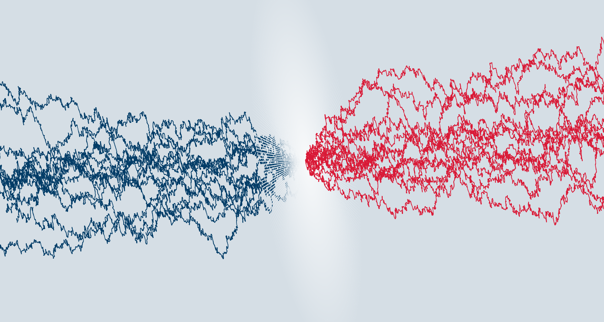

<table align="center">
<tr><td align="center" width="10000">
    
# <strong> CharTED-KMC </strong>



<p>
    <a href="https://orcid.org/0000-0001-7552-9812">Dr. Thomas Pope </a>
    <br>
    <a href="https://ncl.ac.uk/nes/people/profile/tompenfold.html">Prof. Thomas Penfold </a>
    <br>
    <a href="https://orcid.org/0000-0002-8409-6702">Dr. Yvelin Giret </a>
</p>

<p>
    <a href="http://penfoldgroup.co.uk">Penfold Group </a> @ <a href="https://ncl.ac.uk">Newcastle University </a>
</p>

<p>
    <a href="#setup">Setup</a> • <a href="#getting">Quickstart</a> • <a href="#publications">Publications</a>
</p>

</td></tr></table>

#
CharTED-KMC is a Kinetic Monte-Carlo code used to model charge transport in organic semiconductors.

​The code has the following capabilities:

    -- Transport of electrons, holes and excitons.
    -- Interplay between multiple excited states on each site
    -- Miller-Abrahams and Marcus rates
    -- Order parameters to control relative orientation and order within thin films.

</a>

## SETUP

The quickest way to get started with CharTED-KMC is to clone this repository:

```
git clone https://github.com/thomasjamespope/CharTED-KMC/tree/main 
```

This contains all the source files and an example input file - as well as the offline manual.

CharTED-KMC is entirely stand-alone and comes with its own Makefile. The compile, simply go to the code directory and type:

```
make all
```

Now you're good to go!

## GETTING STARTING 
To run CharTED-KMC, type:

```
mpirun -np 4 CharTED-KMC.x input.file > output.o 2> error.o 
```

input.file contains the system parameters and is supplied by the user. output.o and error.o contain, respectively, the standard output and the standard error output for the calculation. Additional output files are also written. The MPI environment is used to generate multiple independent simulations (in this case, 4) using the same input parameters. At the end of the calculation, statistical analysis is performed of the group of simulations to generate physical predictions (like mobility, excitation rate, etc...). It is important to run as many simulations as possible or at the very least 2.

---


| Input parameter | Options | Default | Description |
| --- | --- | --- | --- |
| `DEBUG` | *1 boolean* | .false. | Sets the seed for the random number generator to zero for reproducible calculations |
| `NUMBER_STEPS` | *1 integer* | 1,000,000 | Sets the number of events chosen before the calculation is terminated. This can be set to -1 for an ad infinitum calculation |
| `N_PRINT_STEP` | *1 integer* | 1,000 | Number of hopping events allowed to elapse between writing the various OUTPUT files, with the exception of the trajectory file |
| `N_PRINT_STEP_XYZ` | *1 integer* | 10,000 | Number of hopping events allowed to elapse between writing the trajectory file |
| `N_EQUILIBRATION` | *1 integer* | 2 X N\_PRINT_STEP | The number of flux readings used in the calculation of the charge |
| `DIMENSIONS` | *3 integers* | no default | The number of grid points in x, y and z |
| `CORRELATED_NEIGHBORS` | *1 integer* | 7 | Number of nearest neighbours taken into account to calculate the electrostatic interaction |
| `COUL_CUTOFF` | *1 real number* | 15.0 | Cut-off radius for the Coulomb exclusion zone. The Coulomb term is only recalculated is a hopping event occurs with the cutoff radius of a given site |
| `CALC_TYPE` | *HOLE*, *ELEC* or *FULL* | HOLE | Determines whether holes, electrons or both are considered in the system. If both are considered, singlet and triplet states are also considered |
| `CHARGE_RATE` | *MILLER-ABRAHAMS* or *MARCUS* | MARCUS | Determines type of rate equation you're using. The low-temperature regime can be studied with Miller-Abrahams and the high temperature by Marcus. Note, the high-field regime is poorly described by both, so be careful! |
| `LATTICE` | *1 real number* | 1.0 nm | The distance between nearest-neighbour grid points in nm |
| `REORGANIZATION` | *1 real number* | 0.1 eV | Reorganization energy in eV for the marcus rate calculation. This parameter is ignored if you're using Miller-Abraham rates. |
| `TEMPERATURE` | *1 real number* | 300.0K | Temperature in Kelvin |
| `PERMITTIVITY` | *1 real number* | 3.5 AU | Relative permittivity in Atomic Units |
| `LOCAL` | *1 real number* | 0.1 eV | Charge Localization Factor in eV |
| `ELECTRIC_FIELD` | *1 real number* | 0.05 V/nm | Strength of the applied electric field in V/nm |
| `UNCORRELATED_DISORDER` | *1 real number* | 0.05 eV | Uncorrelated disorder strength in eV |
| `CORRELATED_TYPE` | *RANDOM*, *ORDERED* or *MIXED* | RANDOM | Determines whether the dipole moments are randomly distributed, or whether they are organized in an antiferromagnetic-type configuration. If MIXED is chosen, a scaling factor is used to determine how rigorous the ordering is (see: ORDER_PARAMETER) | 
| `ORDER_PARAMETER` | *1 real number* | 0.0 | Disorder from perfect antiferro symmetry (0 = no disorder) to completely random (1 = random) |
| `DIPOLE_MOMENT` | *1 real number* | 0.5 D | Strength of the average dipole moment in Debye |
| `FERMI_ENERGY` | *1 real number* | 0 eV | Fermi energy in eV |
| `HOLE_DENSITY` | *1 real number* | 0.001 $\text{site}^{-1}$ | Hole density per site |
| `HOLE_HOP` | *1 real number* | 1.0e12 $\text{s}^{-1}$ | Hopping attempt frequency for the holes. This is included in the prefactor to the rate equations and incorporates coupling between sites. It can be understood as an empirical parameter to tune. |
| `HOMO_ENERGY` | *1 real number* | 0 eV | Energy of the highest occupied atomic orbital in eV |
| `HOMO+*n*_ENERGY` | *1 real number* | inactive | Energy of additions HOMO levels in eV. Here, *n* must incrementally increase from 1 for each additional level. |
| `ELEC_RELAX` | *1 real number* | 1.0e15 $\text{s}^{-1}$ | Electron relaxation rate. This is the rate at which an electron in a higher HOMO level will relax to the lowest. It is typically a few orders of magnitude faster than the hopping attempt frequency. |
| `ELEC_DENSITY` | *1 real number* | 0.001 $\text{site}^{-1}$ | Electron density per site |
| `ELEC_HOP` | *1 real number* | 1.0e12 $\text{s}^{-1}$ | Hopping attempt frequency for the electrons. This is included in the prefactor to the rate equations and incorporates coupling between sites. It can be understood as an empirical parameter to tune. |
| `LUMO_ENERGY` | *1 real number* | 0 eV | Energy of the lowest unoccupied atomic orbital in eV |
| `LUMO+n_ENERGY` | *1 real number* | inactive | Energy of additions LUMO levels in eV. Here, *n* must incrementally increase from 1 for each additional level. |
| `ELEC_RELAX` | *1 real number* | 1.0e15 $\text{s}^{-1}$ | Electron relaxation rate. This is the rate at which an electron in a higher HOMO level will relax to the lowest. It is typically a few orders of magnitude faster than the hopping attempt frequency. |


## THEORY

**General KMC**

Holes and/or electrons are distributed onto a grid of points, each with an associated site energy. An electric field is applied across the grid and the system evoles through a series of hopping events, which at chosen at each time step. In order to choose an event, all possible options and associated rates are calculated. The rates, $k_{i}$ are used to generate a normalized cumulative sum,

$\tilde{s}_j=\sum_{i}^{j}k_i, \quad s_j=\frac{\tilde{s}_j}{\tilde{s}_N},$

where $N$ is the number of possible hopping events.

To select an event, a random number uniformly distributed between zero and one, $\eta$, is chosen. The event number, $j$, is given when the inequality is satisfied,

$s_{j-1} < \eta < s_j.$

Once an event is chosen, the system is updated accordingly and the system time is advanced by selecting another random number uniformly distributed between zero and one, $\zeta$, and calculating the time step,

$\Delta t=-\frac{\ln{\zeta}}{\tilde{s}_N}.$

This procedure is repeated until the number of requested steps is reached. 

The time elapsed after each step, $t_{\text{step}}$, is determined by the sum of all calculated rates, $k_{\text{sum}}$, and a number chosen randomly from a uniform distribution between 0 and 1, $\zeta$,

$t_{\text{step}}=-\frac{\ln{\zeta}}{k_{\text{sum}}}.$

The total elapsed time at any given step, $t_{\text{tot}}$, is given by the cumulative sum of all the time steps up to that point. 

**Site Energy Initialization**

Firstly, we specify a grid - which is a 3-dimensional array of evenly spaced points on a cubic lattice. The dimensions may be set with the DIMENSIONS flag and the lattice spacing set with the LATTICE flag. 

CharTED-KMC supports several energy levels per site, depending on whether holes, electrons or both a being considered (declared with the CALC_TYPE flag) and whether additional higher-lying levels are being considered (declared with the HOMO+*n*_ENERGY and LUMO+*n*_ENERGY flags).  Each grid point is given the relevant HOMO and/or LUMO energies, which can be set using the HOMO_ENERGY and LUMO_ENERGY flags respectively. 

Additional, uncorrelated disorder, correlated disorder and an electric field are added to the site,

$E^{\text{site}}_{\bf{i}}=E_{\text{HOMO}/\text{LUMO}}+\text{E}_{\bf{i}}^{\text{unc}}+\text{E}_{\bf{i}}^{\text{corr}}+\text{E}_{\bf{i}}^{\text{field}}$

**Disorder**

The sites are then given additional energy terms associated with three types of disorder: spatially uncorrelated disorder, correlated disorder and antiferromagnetic disorder. 

*Uncorrelated Disorder* is added to every site with a noise width of $\sigma_{\text{unc}}$ (set with the UNCORRELATED_DISORDER flag). To include spatially uncorrelated disorder, the energies $\text{E}_{\textbf{i}}^{\text{unc}}$ are randomly drawn from a Gaussian density of states (DOS)

$g\!\left(\varepsilon\right)=\frac{1}{\sqrt{2\pi}}\frac{1}{\sigma_{\text{unc}}}e^{-\varepsilon/2\sigma_{\text{unc}}^2}$

Here the Ziggurat method for generating random variables is implemented as described by Marsaglia and Tsang. 

This disorder is generated separately for each level on the site.

*Correlated Disorder* at grid point $i$ corresponds to the electrostatic energy resulting from the interaction of its permanent dipole, $\bf{d}_i$ with the permanent dipoles at the other grid points. The resulting energy is given by,

$E_{\bf{i}}^{\text{corr}}=-\frac{e}{\epsilon_0\epsilon_r}\sum_{j\neq i}\frac{\bf{d}_j\cdot\bf{R}_{ij}}{\left|\bf{R}_{ij}\right|^3}$

where $\bf{R}_{ij}$ is the spacial vector between site $i$ and site $j$. For efficiency, only neighbouring sites are considered. The number of neighbouring layers is controlled with the CORRELATED_NEIGHBORS flag. 

The dipole vectors on each site are assumed to have the same magnitude and are arranged in one of two ways depending on user input. This choice is controlled by the CORRELATED_TYPE flag, which can either be set to RANDOM, ORDERED or MIXED. In all cases, the magnitude of the dipole moment is given by the DIPOLE_MOMENT flag. 

If RANDOM is chosen, unit vectors are distributed randomly on each site. If ORDERED is chosen, unit vectors are added to each site with an antiferromagnetic symmetry, where the reference direction is drawn randomly. In MIXED is chosen, disorder from the ordered initial distribution is added using the ORDER_PARAMETER flag, which can be given a value between zero and one.

This disorder in generated once per site and applied to all levels equally. 

**Electric Field**

The electric field, controlled with the ELECTRIC_FIELD flag, is applied step-wise in the $y$-direction by,

$\text{E}_{{\bf{i}}_y}^{\text{field}}=\left(N_y - {\bf{i}}_y\right)\times\left(\text{\texttt{ELECTRIC_FIELD}}\right)\times\left(\text{\texttt{LATTICE}}\right)$

**Charge Distribution**

Given the user-defined grid dimensions, set using the DIMENSIONS flag, and the charge densities, set by the HOLE_DENSITY and/or ELEC_DENSITY flags, the number of charged particles, $N_{\text{h}}$ and/or $N_{\text{e}}$, is determined. Once the site energy distribution is completed, the charge particle distribution is conducted using the scheme outlined by van der Holst.

Firstly, every site is given an occupation probability using the Fermi-Dirac distribution,

$p_i=\left(1+e^{\left(E^{\text{site}}_{\bf{i}}-E_{\text{F}}\right)/k_BT}\right)^{-1}$

where the Fermi energy, $E_{\text{F}}$, is set using the FERMI_ENERGY flag and the temperature is set using the TEMPERATURE flag. The normalized cumulative sum is calculated,

$s_j'=\sum_j{p_i},\quad s_j=\frac{s_j'}{s_N},$

where N is the total number of grid points. 

To select a site, a random number uniformly distributed between zero and one, $\eta$, is chosen. The site number, $j$, is given when the inequality is satisfied,

$s_{j-1} < \eta < s_j.$

A charge particle is placed on site $j$ and $p_j$ is set to zero. The normalized cumulative sum is recalculated and the procedure is repeated until all charged particles are distributed.

**Calculation of Event Options**

For a given configuration, each charged particle is able to hop to a site within a given radius ($\sqrt{3}\times$LATTICE) of its origin site. In the case that only one type of charge particle is considered (where the CALC_TYPE flag is set to either HOLE or ELEC), only charge transport can occur. If both charge types are considered, (where the CALC_TYPE flag is set to FULL), two options are available.

 --- If the destination site is unoccupied, charge transport can occur.
 --- If the destination site is occupied by a particle of the opposite charge, exciton generation can occur.

For a hopping event, from site $i$ to site $j$, there is an associated change in energy for the system, $\Delta E$. Given this change in energy, the hopping rates are calculated using either the Miller-Abrahams or the Marcus rate equations (controlled by the CHARGE_RATE flag). 

The Miller-Abrahams rate equation is given,

$k_{\bf{ij}}=\omega_{0}e^{-2\gamma\left|R_{\bf{ij}}/L\right|}\times
 \begin{cases}
  e^{-\Delta E_{\bf{ij}}/k_BT}&\Delta E_{\bf{ij}}>0\\
  1&\Delta E_{\bf{ij}}\leq0
 \end{cases}$,

where T is the temperature (controlled by the TEMPERATURE flag), $R_{\bf{ij}}$ is the distance between sites ${\bf{i}}$ and ${\bf{j}}$, $L$ is the lattice constant (controlled by the LATTICE flag) and  $\omega_{0}$ is the hopping attempt frequency (controlled by the HOLE_HOP and ELEC_HOP flags).

The Marcus rate is given,

$k_{\bf{ij}}=\omega_{0}e^{-2\gamma\left|R_{\bf{ij}}/L\right|}\times
 e^{-\left(\lambda+\Delta E\right)^2/4\lambda k_BT},$

where $\lambda$ is the reorganization energy (controlled by the REORGANIZATION flag), T is the temperature (controlled by the TEMPERATURE flag), $R_{\bf{ij}}$ is the distance between sites ${\bf{i}}$ and ${\bf{j}}$, $L$ is the lattice constant (controlled by the LATTICE flag) and  $\omega_{0}$ is the hopping attempt frequency (controlled by the HOLE_HOP and ELEC_HOP flags).

**Charge Transport**
 Charge transport occurs when the destination site for a hopping event involving either an electron or a hole in unoccupied. In this case, the change in energy for the system is given by,

$\Delta E = E^{\text{site}}_{\bf{i}} - E^{\text{site}}_{\bf{j}} + \Delta E_{ij}^{\text{coulomb}},$

where $\Delta E_{ij}^{\text{coulomb}}$ is the change in the coulomb energy due to the hopping event. This is calculated using the augmented cut-off radius method. Here, a box of a user-defined number of neighbouring layers (controlled by the COULOMB_NEIGHBORS flag) is drawn around the origin and the destination sites. A third box is defined to encompass both and all sites within the third box are considered in the calculation of the coulomb energy for the origin and destination site. If another charge particle is found within the third box, coulomb energy is given by,

$E_{\bf{i}}^{\text{coulomb}}=\frac{e^2}{4\pi\epsilon_0\epsilon_r}\cdot\frac{1}{R_{ij}},$

where $\epsilon_r$ is the relative permittivity of the medium (controlled by PERMITTIVITY) and $R_{ij}$ is the distance between sites $i$ and $j$. The difference is trivially given,

$\Delta E_{ij}^{\text{coulomb}}=E_{\bf{i}}^{\text{coulomb}}-E_{\bf{j}}^{\text{coulomb}}$

**Exciton Creation**

 If it happens that both an electron and a hole find themselves on the same site after a hopping event, they combine to create a singlet or a triplet (where the choice of which is random, and will select triplets three times more often on average). If extra HOMOs and/or LUMOs have been included, the nature of the singlet/triplet will be determined by the levels of the electron and hole. 

**Outputs**

CharTED-KMC has a variety of output files, which include the run-specific data for each simulation, but the more reliable metrics are usually those averaged over several runs. All averages and output analysis is printed to the standard output, which in most cases will include all the best output data. 

*The carrier flux*, $\Phi$, is defined as the difference of the cumulative count of \emph{upfield} and \emph{downfield} hopping events. This is calculated on a shifted grid, ${\bf{i}}^+$. Here, ${\bf{i}}^+$ consists of grid points shifted for their positions in ${\bf{i}}$ in the direction of the applied electric field by $L/2$, where $L$ is the lattice parameter.

*The mobility* is given by,

$\mu_h=\frac{1}{E_{\text{field}}}\cdot\frac{1}{N_{\text{charge}}}\cdot\frac{\Phi}{t_{\text{tot}}},$

where $N_{\text{charge}}$ is the number of charged particles in the system.

Mobility is calculated in three different ways. The first takes the carrier flux as calculated across the entire run of the simulation. However, since the initial configuration of the charge particles does not include consideration of the coulomb potential, it often leads to unphysical mobilities. The second method considers the carrier flux of the most recent points (the number of points is determined by the N_EQUILIBRATION). However, this is much more susceptible to noise and should be treated with care. The final method is printed at the end of the standard output file. Here, the mobility is calculated with both methods, with the latter approach including increasing amounts of the recent points (from the final 10\% of points to the final 90\%), across all runs of the simulation. This final metric is the most accurate mobility and should be used in preference to the former two methods.  

*The current* is given by,

$\text{J}=\frac{1}{Nx}\cdot\frac{1}{Ny}\cdot\frac{1}{Nz}\cdot\frac{1}{L^2}\cdot\frac{\Phi}{t_{\text{tot}}}.$

At the moment, this is the only way we calculate current. 

*The exciton population* is recorded across all runs of the simulation and a summary is given at the end of the standard output. 

## LICENSE

This project is licensed under the GPL-3.0 License - see the LICENSE.md file for details.

## PUBLICATIONS

[T. Pope](https://orcid.org/0000-0001-7552-9812), [Y. Giret](https://orcid.org/0000-0002-8409-6702), M. Fsadni, [P. Docampo](https://orcid.org/0000-0001-6164-4748), [C. Groves](https://orcid.org/0000-0003-2402-1618), & [TJ. Penfold](https://orcid.org/0000-0003-4490-5672) (2023). *[Modelling the effect of dipole ordering on charge-carrier mobility in organic semiconductors](https://doi.org/10.1016/j.orgel.2023.106760)*, *Organic Electronics*, **115**, 106760.
